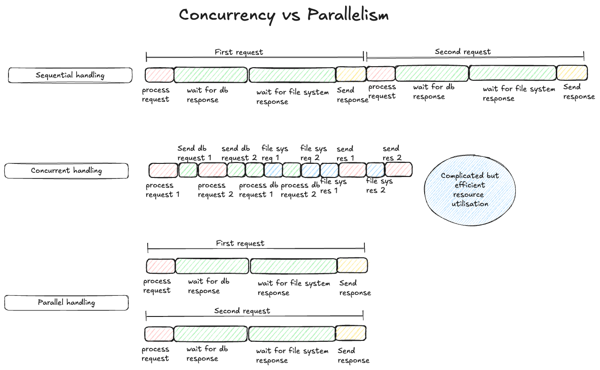

Every talk or blog post on async programming starts by describing the difference between concurrency and parallelism. But most of the descriptions fall short for me. I was still left with a feeling of not getting it completely. I recently came across a perspective which felt like a much better way of looking at concurrency.

Concurrency is mainly about efficiency. It’s about executing a number of tasks with efficient use of resources at hand (including time). Parallelism has nothing to do with efficiency. It just throws more resources at task(s) and makes them finish faster as a result.

Concurrency achieves this efficiency by interleaving tasks. For tasks to be interleaved, we have to be able to break tasks into parts and the parts have to be passable and resumable. That is not a strict criteria, but tasks which have those properties are best suited for running concurrently. E.g. A web server requests which needs some data from a db and some data from a file. The task can be broken down into 4 parts

1. Process request -> Check what is exactly asked for, for which user etc.
2. Make a call to db and wait for it’s response
3. Load file from file system and read it
4. Send a response for the request

This task can be paused at each of the sub task points. E.g. When waiting for the db response. The task can be parked and then picked up again once the db response has come back. And while the program is waiting for the db response, it can interleave a processing of another web server request. Or some part of another web server request. This interleaving of requests allows the program to utilise the CPU more efficiently than if it was processing the requests end to end 1 at a time.

Parallel processing would process both the requests at the exact same time.

For a concurrent system to do its job efficiently, we might have to convert tasks which are not passable and resumable into versions which are passable and resumable. So that the system which handles the concurrency can switch between tasks whenever they deem fit. Otherwise a task might block a concurrent system for a long time and other tasks in queue might be starved of resources.

Concurrency is about doing multiple things efficiently. It’s all about efficiency. If my program is a web server, it can process other requests while the first request is waiting for some database response. For concurrency to be useful, the tasks should be stoppable and resumable. Only then can some system pause one task, move another forward a little and pause it, resume the first task and pause again, the. Resume the second task and so on. The end user would think that all the tasks are running at the same time, but they are not. It’s gives user the illusion that the tasks are running at the exact same time. E.g. if an operating system schedules it’s tasks concurrently, and 1 single task keeps running for a second or 2, the operating system might not be able to refresh the UI and the user would think the whole system is slow. But if that long running task was passable, the OS would pause that task every 16ms, refresh the UI and then resume the long running task. This would ensure that the user thinks the UI is running smoothly at 60 frames per second and the long running task can also be run at the same time in the background. To the user it will feel like both the things are happening at the same time, but the concurrency machinery makes that illusion possible.

Which brings us to the question of when to use concurrency and when not to? Some kinds of programs lend themselves well to be modelled as a concurrent program while others can be handled sequentially. Most programs are ok being run without concurrency and should be. Because concurrency brings in a lot of complexity to the table. E.g. If you write a program which solves a simple equation, you are better off writing it as a regular sequentially run program. (Internally the CPU might still run parts of our equation concurrently, but that’s a different topic. We want to focus on programming language level concurrency).

If you are writing a web server which can receive a lot of requests almost at the same time, and involves IO operations like reading from a database or reading from the file system, it’s a prime candidate to be modelled as asynchronous program (concurrent systems and asynchronous programs are sometimes used interchangeably). This is the main reason nodejs became so popular for writing web servers because it provided the ability to write asynchronous web servers in a very easy way.

Or if you are writing a web browser which needs to render the webpage every 16ms and also do a lot of background processing like making network requests, calculating layout changes due to a changed CSS etc., it’s better off being written as an asynchronous program.

Credit -> I came across the efficiency angle of looking at concurrency from the book “Asynchronous programming in rust” by Carl Fredrik Samson.

Here’s a definition of concurrency and parallelism from that book to ruminate on.

> Concurrency -> dealing with multiple things at the same time.

> Parallelism-> doing a lot of things at the same time
