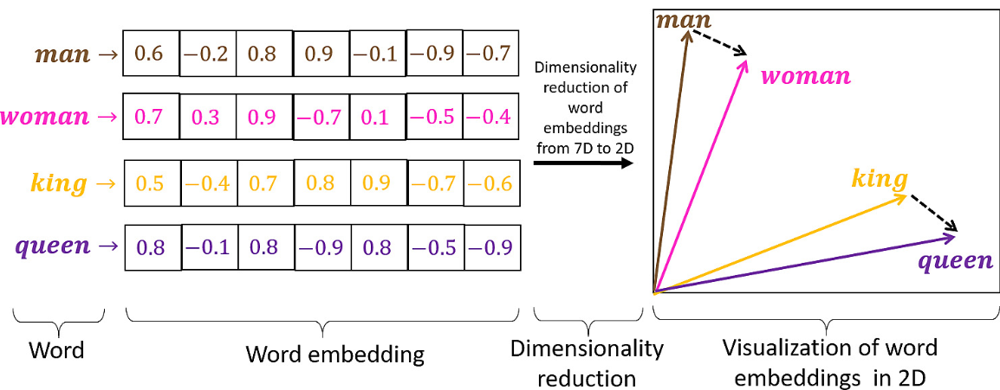

If you want to learn about how LLMs works, there's no getting around embeddings. You have to nail your understanding of embeddings to understand any literature on LLMs.

> We will focus on word embeddings in this article

Machines don't understand text. But they are good are working with numbers. So if we want a system which takes some words and then outputs other words, like a ChatGPT, we have to think of a system to convert the textual data into numbers. That's where embeddings come in.

In layman's terms, embeddings are some kind of mapping between textual (or some other) data to numbers.

We can take all words we find on the internet and assign them a random unique number. Are those numbers embeddings? Not exactly. Embeddings are a little special. They are not simple mappings of text to numbers. The mapping is done in a way that we can compare 2 words or 2 sentences and be able to say things like, "Hmm, these 2 words are very similar". E.g. "Awesome" and "great" are very similar. Embeddings don't stop there. They also consider the context in which the words are used to determine if they are similar or not. E.g. In the sentences "Ice-cream is awesome!" and "Chocolate is great!", "awesome" and "great" are very similar. But in "This pen broke too, great!", "great" is not similar to the "awesome" in "ice-cream is awesome!".

To recap, embeddings are numeric representation of textual information in a way that it makes it very easy to compare words or sentences with similar meaning, also taking care of the context in which the word or sentence is used.

The algorithm to generate word embeddings let's us define what "similar" means. We might want a system where we input 2 words, like "awesome" and "great" and ask the system to tell us how similar they are. In this case we want to check similarity in terms of semantic meaning of the words. But we might want a system where we give 2 words and ask the system how often do these words appear in the same sentence. That's a different kind of similarity. Such a definition of similarity can be used in something like a recommendation engine.

The embeddings are normally not a single number, but a bunch of numbers. They are also called "vector" embeddings. The bunch of numbers form a vector which can be thought of as a point in a multi dimensional space. And once we think of that number mapping as a point in multi dimensional space, we can then think of the similarity between 2 words or 2 phrases as the distance between their embeddings in terms of the absolute distance as well as the direction of the vectors. Maths ✨.

## Intuition
Let's say we map the word "tennis" to the following group of numbers - [-0.4, 4.3, 99.3, -9.4, 35.45]. One way to think about these embeddings is to think of them as labels. The labels have a tag but also the intensity of the tag. E.g. For "tennis", one label we can think of is "sports", with an intensity of 99.3 (the 3rd number in the vector above). Another label we can put is "fun" and that might have an intensity of "50.4". Let's pick one last label - "productivity" and that will have an intensity of "5.4". If we think of the numbers in the vector embedding as labels with intensity, we can now think of an easy algorithm to compare 2 words. Just compare the labels and their intensities. The embeddings we see in the wild are similar but not. That's because we use neural networks to come up with these embeddings. We don't tell them anything about the labels. So the neural networks probably create their own labels and attach a meaning to those labels, but they don't map 1:1 to the way human beings would have labelled a word.

Here's an image i copied from the internet which kind of shows whatever i have said above in a visual format.

We can of course stretch the embeddings concept beyond textual data. Say to audio or video. Can you think of some ways how creating a numeric representation of a video frames might help an AI system?

Once you know about embeddings, you will start having AHA moments when reading papers or articles on AI - "It had nothing to do with sleep 🤯?" Now go ahead and show off your new found knowledge about a fancy term to your friends.
